**TLDR**: The model found the finger, not the moon

# Origins

It started out with a question:

**How similar are various world religions to each other?**

Reading them I can't help but feel they point to similar things. Perennial
philosophy (Huxley) supposes they're all saying the same thing at root.

So is there a way to quantify that?

As you read this each number in parentheses corresponds to a script in the
[github repo](https://github.com/AyyyStew/ComparingFoundationalDocuments) for
anyone who wants to follow along in the code.

**Disclaimer:** I am not a statistician, an academic, or anything of the sort. I
just like poking data. The goal of this is exploration not to establish fact or
truth.

**AI Disclaimer:** AI was used to help generate the scripts and assist with the
prose. However, the main ideas for study came from me. My curioisty was at the
wheel, ai was the engine.

# Bible School

I started by ingesting and embedding the KJV Bible with all-mpnet-base-v2. (01)
Then just looked at the Bible itself — how much variation is there within it,
and how do the books distribute in embedding space? (02)

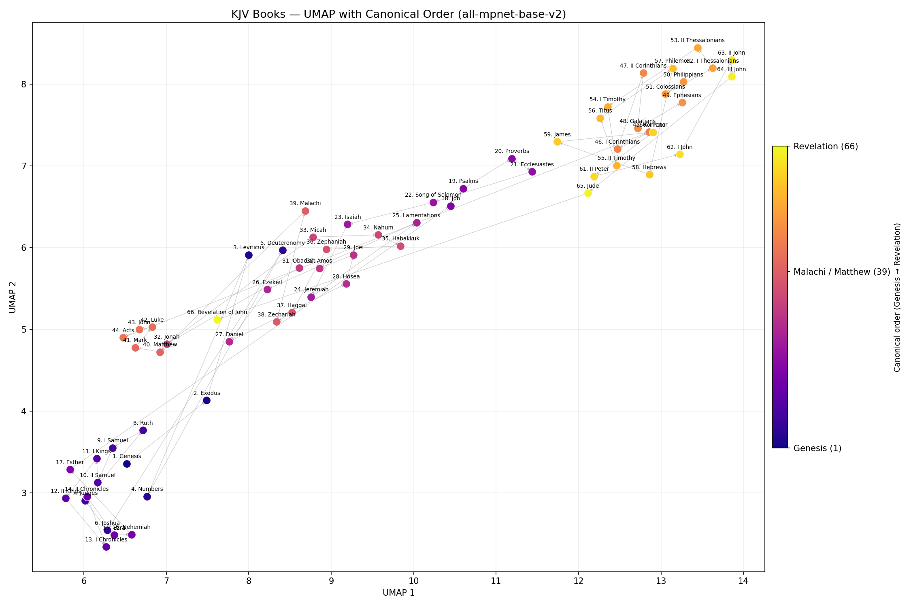

Looking at the plot there are several cluster that seem to form. The gosphels as
thier own blob. Old testament in the bottom right. And several new testament
books in the top right.

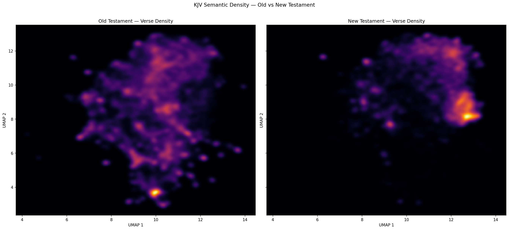

Based on the heatmap, the old testament and new testament show up in differnt
spaces in semantic space.

## How the Bible Varies

A PCA was run on the verse embeddings to see what structure the principal
components picked up. (03)

The first component alone accounts for 27% of variance, which is striking. It
separates the historical and military books (Chronicles, Joshua, Kings, Judges)
from the personal epistles and Gospel of John. The high-end verses are tribal
lists and conquest accounts; the low end is "let not your heart be troubled" and
"believe me that I am in the Father." The axis seems to be something like
external history versus interior theology.

PC2 (12%) pulls Acts and John to one end and the minor prophets to the other.
The high-end verses are about teaching, preaching, and people assembling —
narrative community. The low end is pure prophetic doom: land laid desolate,
enemies scattered, the day of the Lord. A rough label would be narrative
presence versus eschatological warning.

PC3 separates divine covenant language ("they shall be my people, and I will be
their God") from the human-scale books — Ruth, Song of Solomon, Proverbs. The
low end is women in domestic scenes, marriage, physical beauty. This one feels
like the axis between God speaking as a character and humans living among
themselves.

PC4 is the clearest split of the lot: genealogies and place lists (Joshua's
tribal boundaries, Ezra's returnees, Chronicles' "with her suburbs") versus the
four Gospels. Every low-end verse is just Jesus doing something. The model has
found a real axis between administrative record-keeping and the Gospel
narrative.

The remaining PCs get smaller but stay readable.

- PC5 separates personal prayer and praise from civic and moral instruction.
- PC6 isolates supernatural drama — angelic warfare in Daniel, miracles, divine
  deliverance — from Levitical purity and marriage law.
- PC7 is almost entirely about Esther's court: feasts, petitions, royal favor,
  versus genealogical lists at the other end. -PC8 finds the moral-judgment
  language of Proverbs and Kings against the temple measurement passages of
  Exodus and Ezekiel.
- PC9 picks up Job and Ecclesiastes' rhetorical questions — "am I a God at
  hand?", "is my flesh of brass?" — as distinct from communal and feminine
  narrative scenes.
- PC10 separates Christological identity claims ("is this the very Christ?",
  "the firstborn of every creature") from humble personal piety.

Ten components account for 74% of variance. The top four — history/theology,
prophetic doom/community action, covenant/domestic life, lists/Gospel are the
main axes the model finds in the Bible. The rest are real but smaller contrasts
in register and genre.

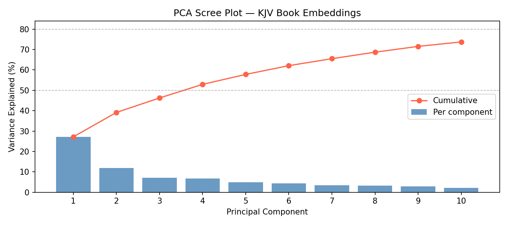

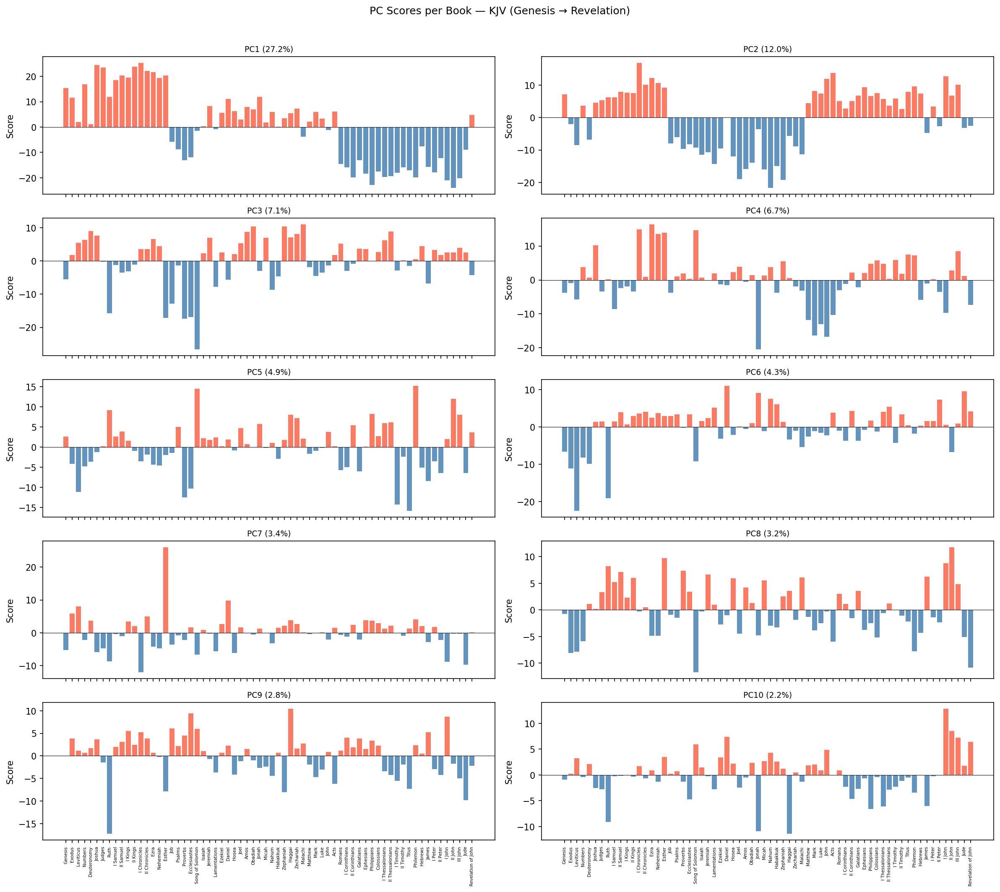

## (Not) Lost in Translation

The Bible has many translations, so a few versions were embedded alongside the
KJV to see how much translations actually diverge from each other. Using the KJV
as a baseline, ACV, YLT, and BBE were compared via cosine similarity. The BBE
had the lowest similarity scores overall, but all versions were quite close —
the lowest similarity score across any book was 0.692 on Job in the BBE.
Translations vary in register but the semantic content stays consistent. (04)

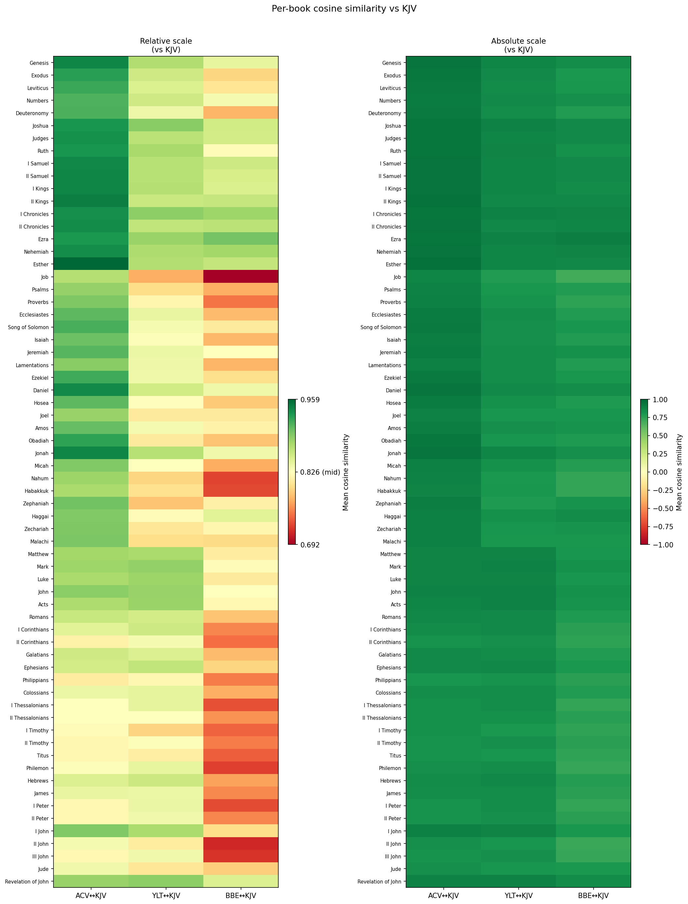

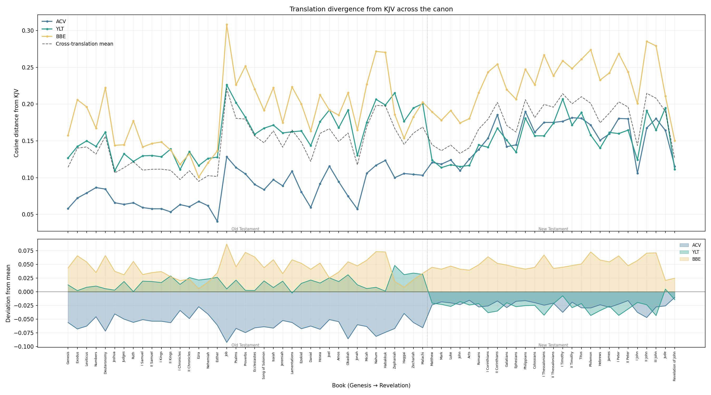

Aggregation method was also tested: does rolling up verse embeddings by mean,
weighted mean, or other methods change the shape of the UMAP cloud? Several
approaches were tried and the overall structure stayed stable, which was
reassuring. (05)

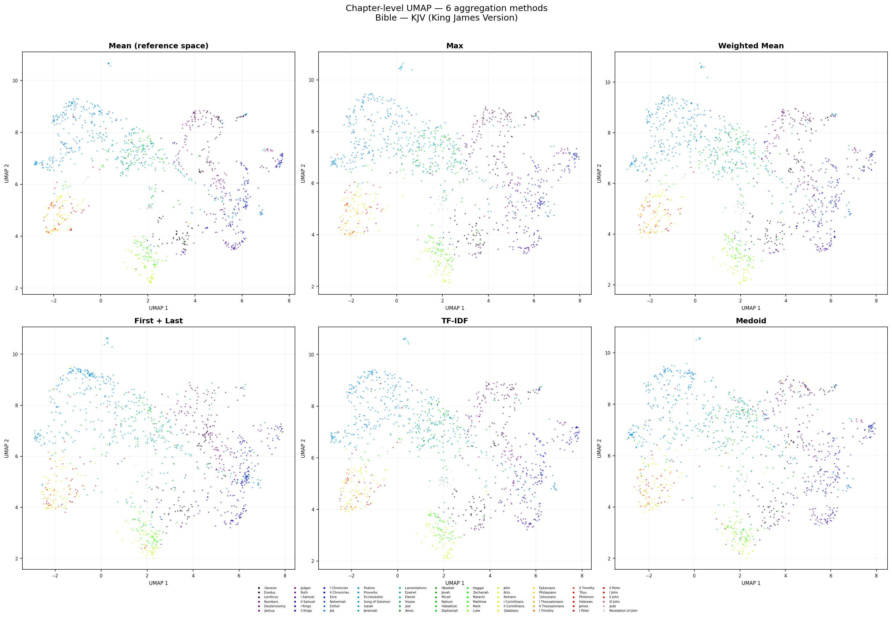

# Getting Gita With It

The Bhagavad Gita was the first non-Bible text brought in as a starting point
for cross-tradition comparison. (06)

Plotted against the KJV in UMAP space, the Gita sits off to the side — close
enough to touch the edge of the Bible cloud but clearly its own thing. They're
not covering the same territory, but they're not far apart either. (07)

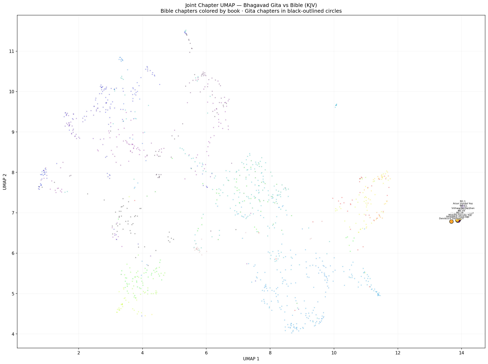

Comparing each chapter of the Gita against the KJV books in a heatmap, the Old
Testament comes out as the most dissimilar, while the wisdom books and epistles
are more similar. Whether that's stylistic or thematic is hard to say — the Gita
is poetic and aphoristic, which is closer in register to Psalms or Proverbs than
to Leviticus.

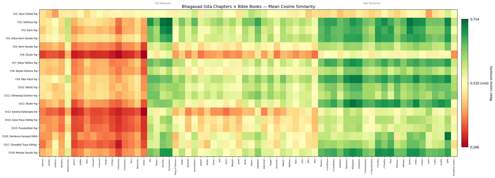

Zooming in on the wisdom books and epistles specifically, the Karma Yoga,
Sankhya Yoga, and Moksha Yoga chapters resonate most strongly across the board.
Dhyana Yoga stands out as the least similar to anything in the Bible — which
makes some sense, as it's the most technically meditative section. (08)

The same script also plots the similarity distributions directly: within-Bible
random pairs, within-Gita all pairs, and cross-tradition random pairs on the
same axis. The within-tradition distributions sit at roughly the same place —
medians around 0.32–0.34 — and the cross-tradition distribution shifts left to
around 0.21. They overlap substantially, but the gap is real. A random
Gita-Bible pair is less similar than a random verse-to-verse draw within either
text.

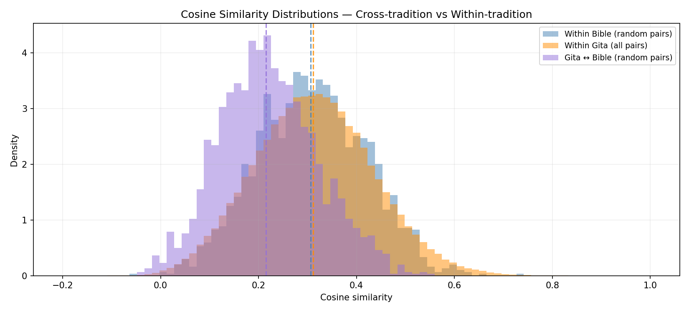

# Expanding the Corpus

At this point a few other corpora were added:

- Dhammapada (09)
- Dao De Jing (10)
- Yoga Sutras of Patanjali (11)
- Literature: Frankenstein, Romeo and Juliet, Don Quixote, Pride and Prejudice
  (12)
- Historical documents: Luther's 95 Theses, Code of Hammurabi, US Constitution,
  Magna Carta, Federalist Papers, Communist Manifesto (13)

The core question was whether the spiritual texts cluster together compared to
historical and legal documents. There's a materialist argument that religion
functions as a coordination mechanism — like law or governance — and if so,
maybe they share a semantic fingerprint.

Literature was added as a third reference point.

What was found was that the spiritual, historical, and literary texts tend to
cluster separately. (14) With one notable exception: the Code of Hammurabi lands
within the spiritual cluster.

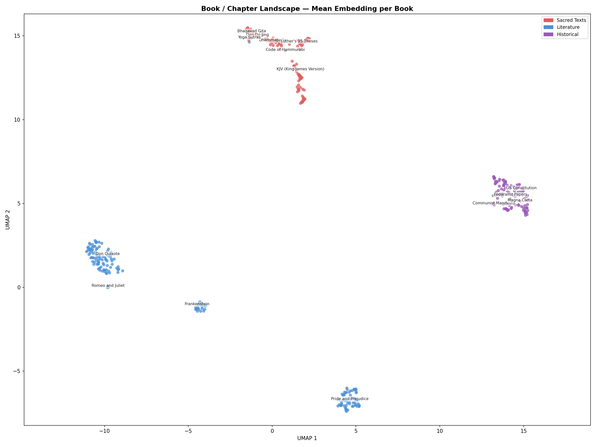

The Hammurabi finding made me wonder whether the clustering is picking up on
theme at all, or just surface style. Hammurabi is still framed as divine law,
written in the voice of a god issuing commandments. So maybe the model is
responding to register and syntax rather than meaning.

## The News

Sports and business news articles from 2015 onward were added as a modern
baseline with little sacred content whatsoever. (15)

The news as a whole floated off into its own region of embedding space, which
was expected. But when sports and business articles were separated and plotted,
something interesting appeared: business news clustered with the historical
documents, while sports news clustered with literature and religion. (16)

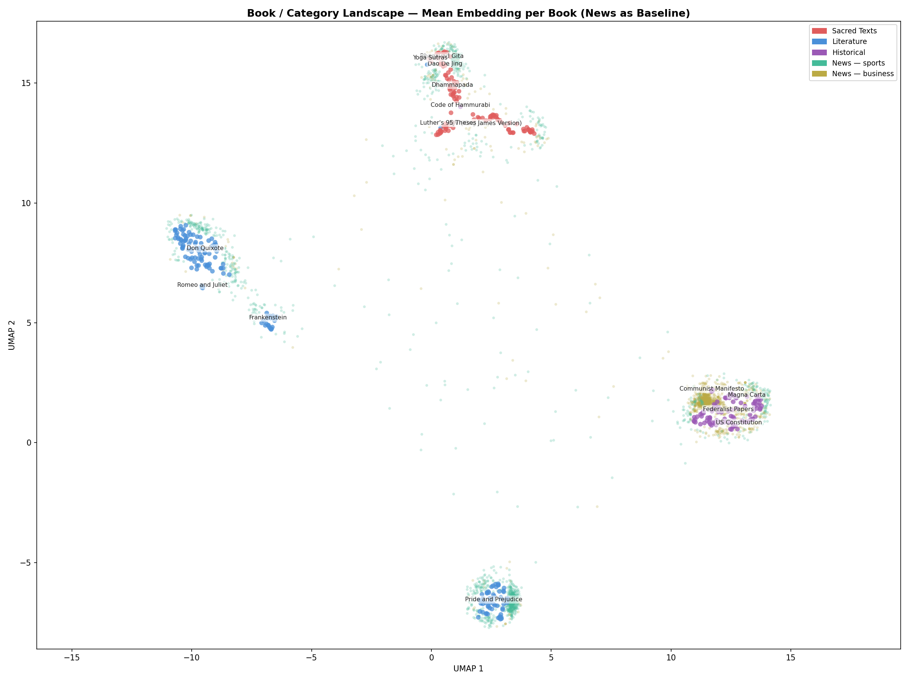

The best explanation I have is narrative language versus factual language.
Sports writing is about struggle, triumph, loss, and meaning — the same register
as fiction and sacred text. Business writing is terse and transactional. The
model seems to be picking up on something like mode of address: are you telling
a human story, or reporting a fact?

A few BERTopic analyses were run across the full corpus at this point (17) but
didn't reveal much beyond the obvious — the dominant topic was a broad god/lord
cluster containing everything except the news, with news forming its own topics.
Useful as a sanity check that the sacred texts are topically distinguishable
from news, but not a particularly deep finding.

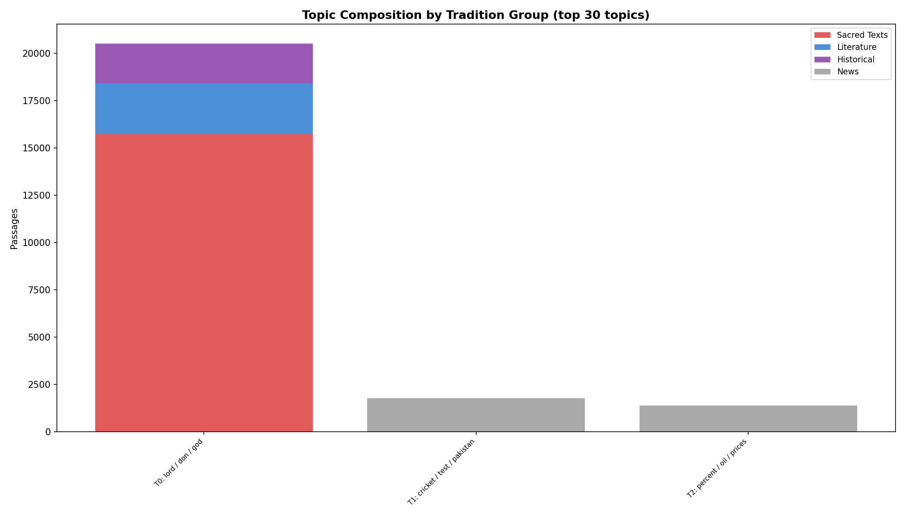

## Bridges

Script 18 asked: across all the traditions and groups collected so far, what
passages pull most strongly across tradition lines? For each tradition, it found
the nearest neighbors in every other tradition and looked for passages that
showed up repeatedly — ones pulled toward by three or more other groups. These
are "bridge passages," semantically resonant across traditions.

A cross-tradition similarity heatmap shows mean similarity between the four
groups. Worth noting how this is computed: it isn't random-pair sampling like
the earlier distribution plot. For each passage, the script finds its top-5
nearest neighbors in every other group, then averages those similarity scores.
So the numbers represent how similar these groups are *at their closest* — when
they're trying their best to agree.

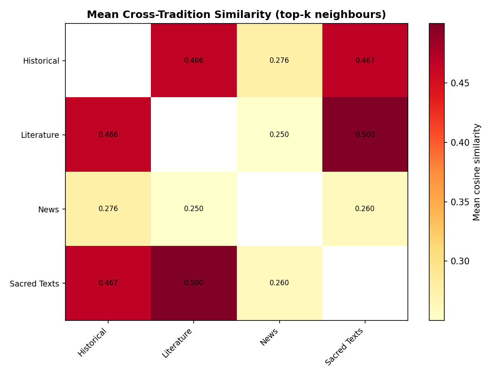

Even on that generous framing, News scores low across the board: 0.276 against
Historical, 0.250 against Literature, 0.260 against Sacred Texts. The other
three groups are all pulling toward each other in the 0.46–0.50 range. Sacred
Texts ↔ Literature was the highest pair at 0.500, slightly edging out Sacred
Texts ↔ Historical at 0.467.

Heatmaps were also produced comparing each sacred text against various
literature works one-on-one. They're long and not displayed here but are in the
repo if you are curious. (19)

Sacred texts were also compared directly against each other in the same format.
(20) If you want to see where the Dao De Jing and the Dhammapada agree most,
this is the analysis for that.

## Soft Clustering: GMM Topics

Rather than hard cluster labels, Gaussian Mixture Models were used to assign
soft probabilities across topics — every passage belongs to every topic to some
degree. This felt more honest given how fuzzy the actual topic boundaries are.

A BIC sweep was run first to find the right number of components (21a), then the
model was fit at K=20 for the full corpus (21b). The same was done for sacred
texts only (22a, 22b).

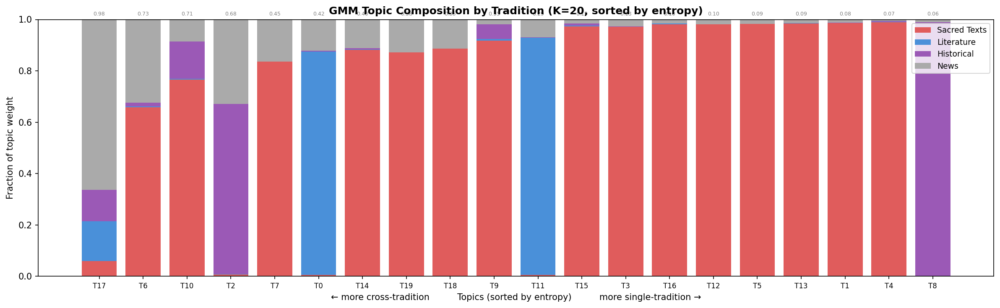

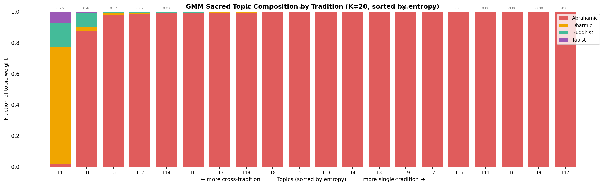

Both charts sort topics by entropy, left to right — more cross-tradition on the
left, more single-tradition on the right. The right side of both is almost
entirely red (Sacred Texts / Abrahamic), which makes them look like a wall of
Bible. But the left side is the more interesting part.

In the full corpus chart, topics T17, T6, and T10 show real mixing between
Sacred Texts, Literature, and News. In the sacred-only chart, T1 is visibly
shared across Abrahamic, Dharmic, and Buddhist, the one topic that no single
tradition owns. The actual finding is a gradient: a handful of genuinely
cross-traditional topics, then a long tail of tradition-owned ones.

The Abrahamic dominance is partly a size problem. The Bible alone has \~31k
verses against \~1-2k for most other texts, but the sacred-only run still shows
the same pattern even after Literature and News are removed. So the size issue
is real, but it's probably not the whole story. The traditions are also just
topically distinct from each other.

## Cross-Tradition Nearest Neighbors, Sacred Only

A cleaner version of the script 18 analysis restricted to just the sacred texts
— Abrahamic, Dharmic, Buddhist, Taoist. (23) Dropping Literature, News, and
Historical removes the noise and asks a cleaner question: where do the world's
religious texts actually agree?

The within- vs cross-tradition similarity heatmap shows the diagonal is higher
for every tradition. Abrahamic is the most internally coherent at 0.710,
followed by Buddhist (0.637), Dharmic (0.624), and Taoist (0.605).
Cross-tradition scores sit tightly in the 0.44–0.52 range across every pair — no
two traditions are dramatically closer or further from each other than any
other.

Worth noting: all values in the heatmap are computed the same way — mean
similarity of each passage's top-5 nearest neighbors, with self-similarity
excluded on the diagonal. This is the same "best match" framing as script 18,
not random-pair sampling. The numbers are higher than they would be under random
sampling (as in the 07 distribution chart), but the comparison is
apples-to-apples across all cells.

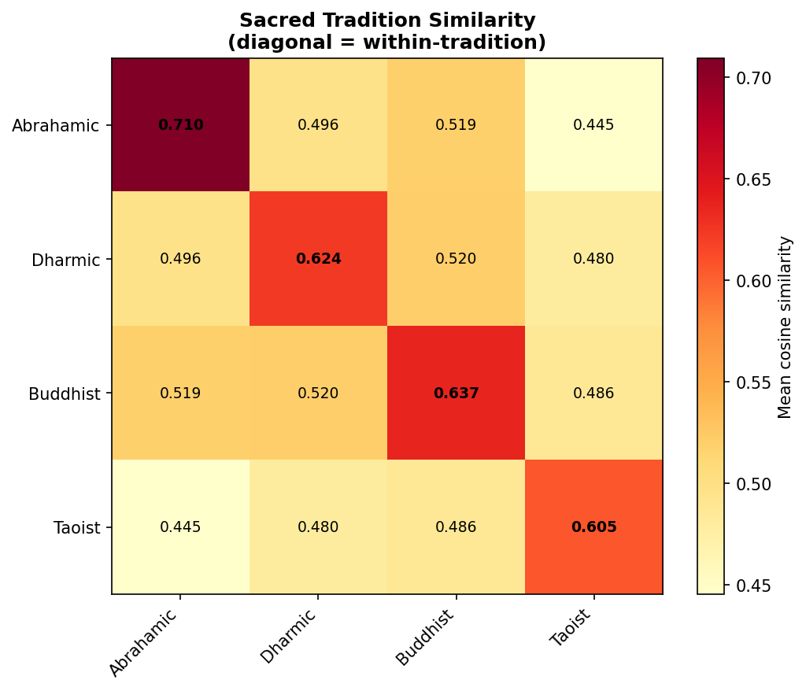

Bridge passages — ones pulled toward by two or more other sacred traditions —
were fed into BERTopic. The two largest topics (around evil/death/soul and
heart/riches/self) showed contributions from all four traditions. Topic 2,
themed around nirvana, spiritual practice, and material life, was notably more
Dharmic and Buddhist with significantly less Abrahamic presence. A wisdom topic
(wise, understanding, fools) also showed a good cross-tradition mix. The size
imbalance is still visible — Abrahamic passages dominate most topics by count —
but the bridge filter does a reasonable job of pulling the shared signal to the
surface.

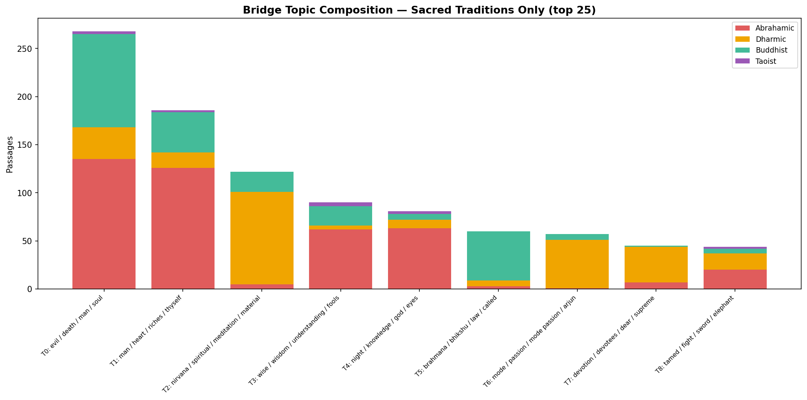

Running the same heatmap with random-pair sampling instead of top-k (23b) shows
just how much that method inflates the numbers. Abrahamic within-tradition drops
from 0.710 to 0.311, Dharmic from 0.624 to 0.303, Buddhist from 0.637 to 0.356,
Taoist from 0.605 to 0.297. Cross-tradition scores fall similarly, landing in
the 0.20–0.31 range. The rank order shifts too — Buddhist comes out as the most
internally coherent tradition on random pairs, while Taoist drops to the lowest.
The highest cross-tradition pair is Buddhist ↔ Taoist at 0.314, and the lowest
is Abrahamic ↔ Dharmic at 0.205.

The within-tradition advantage still holds on random pairs, just less
dramatically. The top-k method is useful for finding where traditions *can*
agree; random pairs show the baseline of how much they agree by default.

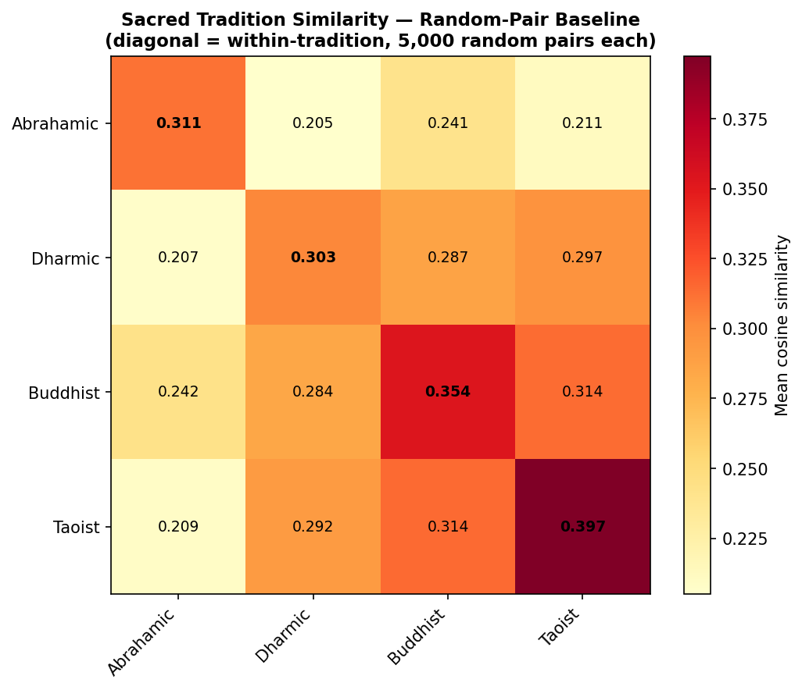

Subtracting random from top-k and taking the ratio gives a lift analysis (23c) —
how concentrated is the similarity, rather than how large is it.

The difference panel shows every diagonal is the darkest cell in its row:
within-tradition similarity is always more inflated by the best-match method
than cross-tradition similarity. Abrahamic has the highest diagonal lift
(0.399), which makes sense the Bible has dense internal hot pockets of
near-duplicate passages (parallel accounts, repeated genealogies, epistolary
formulas). Taoist has the lowest (0.208), meaning the Dao De Jing's internal
similarity is more evenly spread without those spikes.

The ratio panel tells the same story in relative terms. Abrahamic's top-5
neighbors are 3.28x more similar than a random draw. Taoist's are only 1.52x.
The off-diagonal ratios sit in a tighter band of 1.48–1.90 across all
cross-tradition pairs — fairly uniform regardless of which two traditions you're
comparing.

The structural finding: when traditions agree across boundaries, that agreement
is more *diffuse* than within-tradition similarity. It's not a few passages that
happen to match perfectly — it's a broader low-level resonance spread throughout
the texts. Within-tradition clustering is spiky; cross-tradition overlap is
flat.

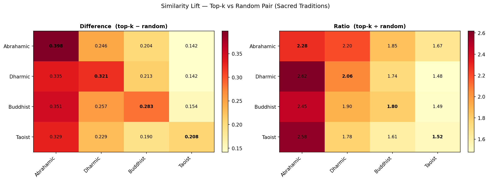

## Concept Networks

This is where the analysis shifted from similarity scores to structure.

The idea: if passages cluster into semantic neighborhoods (via HDBSCAN on a UMAP
reduction), and passages from different traditions land in the same
neighborhood, that neighborhood is a shared concept. You can then build a graph
where nodes are concepts and edges represent co-occurrence — two concepts
connected if passages from the same tradition frequently appear in both.

First attempt (24) used all sacred passages as-is. The problem: the Bible has
\~31k verses and the other texts have \~1-2k each. The network was dominated by
intra-Bible connections and the signal from other traditions got drowned out.

<iframe src="24_concept_network.html" width="100%" scrolling="no" style="border:none;display:block;" onload="this.style.height=(this.contentWindow.document.body.scrollHeight+20)+'px';"></iframe>
[Open in full page](24_concept_network.html)

Second attempt (25) rebalanced by filtering the Bible down to only its passages
most relevant to the other traditions — pulling the \~1,200 most cross-resonant
Bible verses rather than all 31k. This gave a fairer playing field and produced
a more interpretable network.

<iframe src="25_concept_network_balanced.html" width="100%" scrolling="no" style="border:none;display:block;" onload="this.style.height=(this.contentWindow.document.body.scrollHeight+20)+'px';"></iframe>
[Open in full page](25_concept_network_balanced.html)

Graph theory analysis was then run on the balanced network (26). Some findings
worth noting:

- The network has about 30 concept nodes and 80 edges
- The highest betweenness hub (the concept that acts most as a bridge between
  others) was a cluster around death/sorrow/body — present across all traditions
- Four Louvain communities were detected; the most cross-traditional had
  participation from all four tradition groups
- All traditions are connected within 1-2 hops of each other in the concept
  graph — there's no tradition that's semantically isolated from the rest

## Narrative Flow

A different kind of question: do the sacred texts move through semantic space in
a coherent way, or do they jump around? (27)

Chapter-mean positions were computed in UMAP space and plotted as trajectories
with arrows showing direction. Each text gets its own subplot. The result is a
kind of semantic path — you can see whether a text starts in one region and ends
in another, or stays in one place throughout.

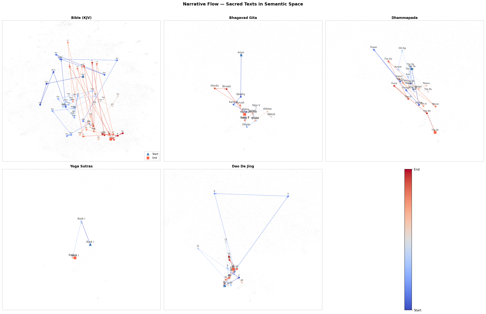

## Outliers

What passages are most out of place within their own tradition? And what
passages wander most toward another tradition? (28)

The outlier analysis found that Abrahamic outliers (passages least similar to
the Abrahamic centroid) tend to drift toward Buddhist semantic space more than
any other direction — 9 of the top 10 cross-tradition wanderers land nearest to
Buddhist passages. Dharmic outliers tend toward Abrahamic. Taoist texts were the
most internally consistent of the group (highest mean within-tradition
similarity), while Abrahamic and Dharmic had more internal variance.

A few of the specific outlier passages are striking when you read them. Proverbs
14:14 shows up as an Abrahamic passage closest to Buddhist: "The backslider in
heart shall be filled with his own ways." It reads like something about karma.

<iframe src="28_outliers_within.html" width="100%" scrolling="no" style="border:none;display:block;" onload="this.style.height=(this.contentWindow.document.body.scrollHeight+20)+'px';"></iframe>
[Open in full page](28_outliers_within.html)

<iframe src="28_outliers_cross.html" width="100%" scrolling="no" style="border:none;display:block;" onload="this.style.height=(this.contentWindow.document.body.scrollHeight+20)+'px';"></iframe>
[Open in full page](28_outliers_cross.html)

# Expanding the Corpus: Norse, Confucian, Philosphy, Science

The corpus was expanded to include passages from traditions including
philosophy, science, literature, Norse, and Confucian. A final UMAP was run.
(33) Two versions: one with everything overlaid and one faceted with each
tradition highlighted one at a time against a grey background.

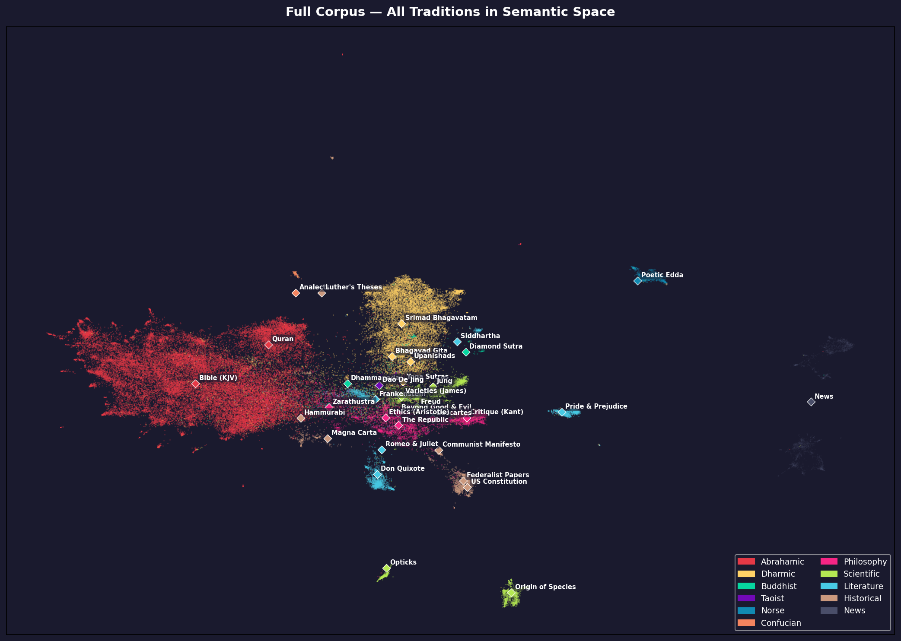

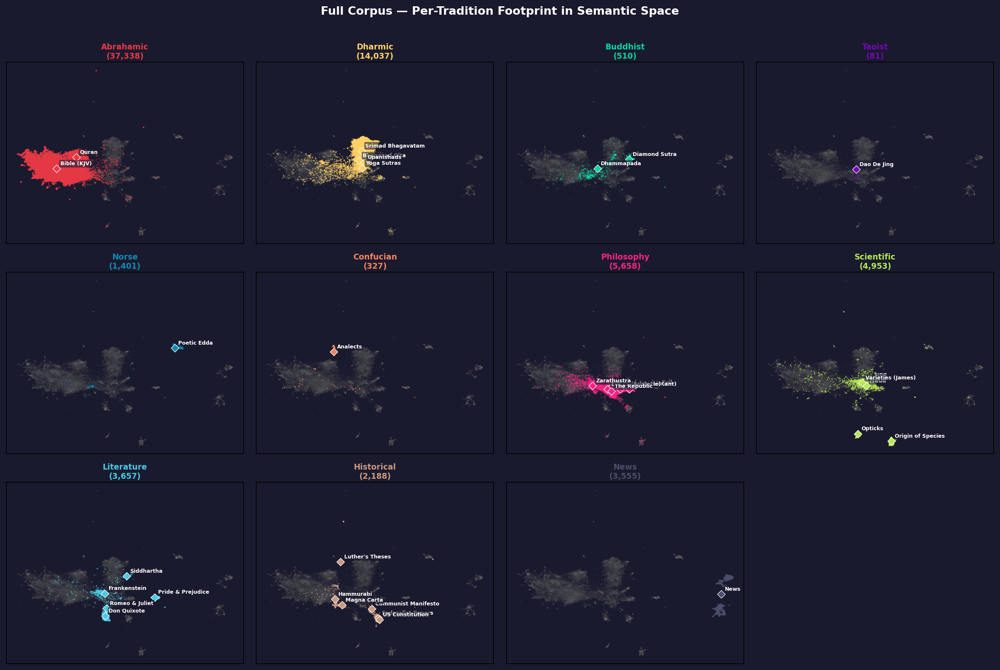

Some things that stood out in the full picture:

- Hard science (Newton, Darwin) sits relatively isolated from everything else
- Siddhartha (the Hesse novel) lands closer to Dharmic sacred texts than to the
  literature cluster — which is funny, it's about the Buddha, but it's still a
  novel
- William James and Jung act as bridges between the sacred cluster and the
  scientific/literary cluster, which makes sense — they're both writing about
  religious experience from a psychological lens

## Universal and Distinct Passages

What are the most semantically universal passages across all traditions, and
what are the most distinct? (34)

Top cross-tradition pairs by cosine similarity turned up some genuinely
interesting matches:

- Nietzsche's Zarathustra and Jung's Psychology of the Unconscious share the top
  slot — both describing something like existential torment and the weight of
  self-knowledge
- Matthew 5:43 ("love thy neighbour") and a passage from Freud's Civilization
  and its Discontents discussing that same commandment came in second — Freud is
  directly engaging with the text but the embedding doesn't care, it just sees
  two passages about the same idea
- Kant and Darwin on systematic classification appeared paired — both doing the
  work of categorizing a complex system rigorously
- 1 John 4:18 ("perfect love casteth out fear") and Dhammapada 16.215 ("from
  love comes grief, from love comes fear") — two texts saying almost opposite
  things about the relationship of love and fear, but landing in adjacent
  semantic space

The most isolated passages — those with no good cross-tradition match — tended
to be highly technical or ritual in nature: specific legal clauses, genealogies,
procedural instructions. The stuff that's rooted in a specific cultural context
with no analogue elsewhere.

[Output of the Similarty Analysis](34_universal_passages.txt)

## Expanded Concept Network

A final concept network was built on the full expanded corpus (36), balancing
the oversized corpora (Bible, Bhagavatam, Quran were all capped and filtered to
their most cross-relevant passages). About 16k total passages clustered into
roughly 35 concept nodes.

This is probably the most complete picture the project produced of what the
traditions share at a structural level — not just "these two passages are
similar" but "here are the shared conceptual neighborhoods and here is how they
connect."

<iframe src="36_concept_network_full.html" width="100%" scrolling="no" style="border:none;display:block;" onload="this.style.height=(this.contentWindow.document.body.scrollHeight+20)+'px';"></iframe>
[Open in full page](36_concept_network_full.html)

### Going Deeper: Semantic Edges and Entropy

The co-occurrence graph has a structural problem worth naming. An edge between
two concept clusters means passages from both clusters appeared in the same
chapter. But "same chapter" is doing a lot of work. Two concepts might co-occur
in a hundred chapters — but if all those chapters are from the same book of the
Bible, the edge doesn't tell you much about cross-tradition resonance. It tells
you about Bible chapter structure.

A second issue: co-occurrence measures proximity, not meaning. Two clusters
might keep appearing together because they're both common topics in discursive
chapters, not because they're conceptually linked.

To address both, a second graph was built (36b) where edges are drawn on a
different basis entirely: cosine similarity between cluster centroids. If the
average passage in cluster A is semantically close to the average passage in
cluster B, they get an edge. And crucially, only clusters that already contain
passages from at least two different traditions are eligible — so the edges are
filtering for genuinely cross-traditional semantic neighborhoods, not
single-tradition clumps that happen to be close to each other.

The result looks different from the co-occurrence graph. The edges are sparser
and the connected nodes are more interpretable as candidates for shared
cross-traditional concepts. Nodes with many centroid edges spanning multiple
traditions are the strongest candidates the data can offer for something like
universal themes.

<iframe src="36b_concept_network_centroid.html" width="100%" scrolling="no" style="border:none;display:block;" onload="this.style.height=(this.contentWindow.document.body.scrollHeight+20)+'px';"></iframe>
[Open in full page](36b_concept_network_centroid.html)

The same analysis was re-run restricted to sacred texts only (36c) — dropping
Literature, Historical, Scientific, and Philosophy to ask a cleaner version of
the original question. When the noise of secular traditions is removed and only
the religious texts compete for shared semantic space, the connected clusters
are the ones with the strongest claim to being perennial themes.

<iframe src="36c_concept_network_sacred.html" width="100%" scrolling="no" style="border:none;display:block;" onload="this.style.height=(this.contentWindow.document.body.scrollHeight+20)+'px';"></iframe>
[Open in full page](36c_concept_network_sacred.html)

To quantify which nodes are genuinely multi-traditional rather than just
dominated by one text, Shannon entropy was computed over the tradition counts
for every node (36d). Entropy of 1.0 means all traditions are equally
represented in that cluster; 0.0 means one tradition owns it entirely. The
high-entropy nodes are worth reading closely — they're the concept neighborhoods
where the data is least explainable by any single tradition's size or style.

Entropy tables for each graph: [Full corpus](36_concept_graph_entropy.csv) ·
[Centroid edges](36b_concept_graph_entropy.csv) · [Sacred
only](36c_concept_graph_entropy.csv)

A few things worth noting from the entropy results.

In the full-corpus centroid graph (36b), the most balanced node — highest
entropy across all traditions — was a cluster labeled around **honour, virtue,
and wealth** (cluster 28). Nine of the ten traditions are present in it, with
Philosophy and Abrahamic passages making up the bulk but Buddhist, Dharmic,
Taoist, Confucian, Scientific, Literature, and Historical all showing up. The
second most balanced was a cluster around **vanity and hidden worth** (cluster
29) — and the surprise there is that it's almost exactly split between Abrahamic
(84 passages) and Buddhist (59 passages), with the other traditions barely
present. If you were going to identify one specific Bible-Buddhism bridge in the
data, this is probably it.

The sacred-only graph (36c) tells a sharper story because the secular noise is
gone. The single most balanced cluster — nearly perfect entropy, 0.996 out of
1.0 — was around **divine manifestation through natural phenomena**: thunder,
fire, sea, the burning of trees. Exactly 29 Dharmic passages and 25 Abrahamic
passages, almost nothing else. Two traditions independently reaching for the
same imagery when they want to describe the presence of the divine. The second
most balanced was a **wisdom and foolishness** cluster spanning all six sacred
traditions (Abrahamic, Buddhist, Norse, Dharmic, Taoist, Confucian) — the only
cluster in the sacred graph where every tradition is represented.

On the other end, about a third of the sacred-only clusters have entropy of
exactly zero — they belong entirely to one tradition with no crossover at all.
These tend to be the most contextually specific: Exodus narrative passages,
Bhagavad Gita cosmology, Norse genealogies. The data has a real structure to it
— a handful of genuinely shared concepts, a long tail of tradition-owned ones,
and almost nothing in between.

## Tradition Similarity

The full 10-tradition top-k similarity heatmap (News excluded so the scale isn't
crushed) shows Literature with the highest within-tradition coherence at 0.744,
followed by Historical at 0.734 and Philosophy at 0.768. The sacred traditions
cluster in the 0.60–0.70 range. Scientific is the lowest diagonal at 0.699,
which makes sense — Newton, Darwin, Freud, James, and Jung don't share much
surface vocabulary even if they share a mode of inquiry.

Cross-tradition, the highest pairs are Philosophy ↔ Historical (0.557) and
Dharmic ↔ Taoist (0.567). Abrahamic ↔ Norse is one of the lowest at 0.364.

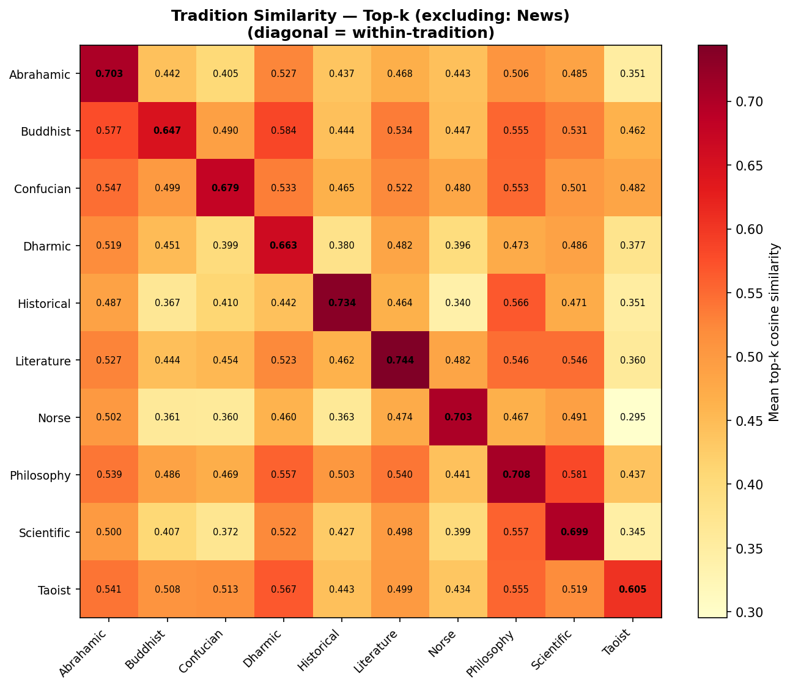

The lift analysis shows how much of that similarity is concentrated versus
diffuse. Literature has the highest diagonal ratio — its best internal matches
are very good relative to a random draw. Sacred traditions have more moderate
lift, meaning their internal similarity is more evenly spread. The difference
panel (top-k minus random) is the clearest view of which cross-tradition
connections are genuinely concentrated versus just broadly present.

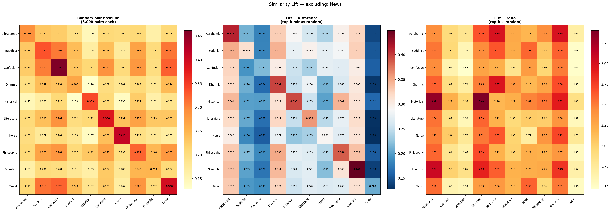

## Similarity Distributions

The interactive distribution chart shows the average within-tradition curve
against the pooled cross-tradition curve. Individual traditions can be toggled
on for comparison.

<iframe src="final_distributions.html" width="100%" scrolling="no" style="border:none;display:block;" onload="this.style.height=(this.contentWindow.document.body.scrollHeight+20)+'px';"></iframe>
[Open in full page](final_distributions.html)

## Outliers on the Full Corpus

Re-running the outlier analysis on the full corpus changes some of the earlier
findings. With 11 traditions now providing the centroid landscape, Abrahamic
wanderers no longer go primarily toward Buddhist space — they go Confucian
(5/10). The earlier Buddhist finding from script 28 was likely an artifact of
the limited tradition set, where Buddhist was the closest available alternative
for certain Abrahamic passages.

A few other patterns from the destination table: Literature wanders toward
Buddhist (8/10). Philosophy wanders toward Historical (9/10). Scientific wanders
toward Abrahamic (7/10), which is the most surprising — the scientific texts in
the corpus (James, Jung especially) apparently drift toward sacred space when
they're at their least typical.

<iframe src="final_outliers_within.html" width="100%" scrolling="no" style="border:none;display:block;" onload="this.style.height=(this.contentWindow.document.body.scrollHeight+20)+'px';"></iframe>
[Open in full page](final_outliers_within.html)
<iframe src="final_outliers_cross.html" width="100%" scrolling="no" style="border:none;display:block;" onload="this.style.height=(this.contentWindow.document.body.scrollHeight+20)+'px';"></iframe>
[Open in full page](final_outliers_cross.html)

[Full outlier report](final_outliers_report.txt)

# Answers and More Questions

The original question was whether world religions point to similar things, and
whether that similarity is quantifiable.

The answer seems to be: yes, and yes, but with caveats.

The clearest finding is structural: cross-tradition similarity is lower than
within-tradition similarity. This sounds obvious but it's worth stating — the
embedding model can distinguish traditions from each other. The texts are not
all saying the same thing in the same way.

But the cross-tradition signal is real and non-trivial. Shared semantic
neighborhoods exist around themes like suffering and its causes, moral action
and consequence, the relationship between self and something larger, and the
nature of fear and love. These aren't just surface-level lexical overlap — they
show up even across translations and across traditions.

The business/sports split from the news analysis also stuck with me. It suggests
the embeddings are picking up on something like narrative register — not just
topic but mode of address. Sacred texts cluster with sports journalism and
literature, not with business reporting. The writing style of transcendence,
struggle, and meaning seems to be a real axis in this embedding space.

The outlier analysis changed when the full corpus came in. The earlier finding —
that Abrahamic passages wandering out of their tradition head toward Buddhist
space — turned out to be an artifact of a small tradition set. With 11
traditions available, Abrahamic wanderers go toward Confucian. The finding was
real within its context but didn't generalize. That's worth keeping in mind for
everything else here too.

Which brings me to the question I kept returning to as this went on: what is the
embedding model actually measuring?

The sports/business split suggests it's picking up something like register — the
grammar of how you're addressing a reader, not just what you're saying. The
Hammurabi finding (sacred texts cluster with a legal code written in the voice
of a god) points the same direction. The model may be responding more to surface
structure — second-person address, imperative mood, abstraction level, sentence
rhythm — than to underlying theological content.

That would mean the shared signal between, say, the Dhammapada and the Psalms
isn't necessarily that they're saying the same thing about the nature of
existence. It might be that they're both written in a particular register:
direct address, elevated diction, aphoristic compression.

Or it might be that style and content aren't as separable as that framing
implies. If every tradition independently converged on aphoristic,
second-person, morally weighted language to describe their highest truths, that
convergence might itself be the signal. The form is part of the meaning.

I don't have a way to answer that question with the tools used here. It would
require something like controlled experiments with paraphrased passages — does
the similarity survive rewriting in a different register? That's a different
project.

What this project did establish is that embedding space has real structure, that
the structure tracks something meaningful about how humans write about
transcendence and meaning, and that the boundaries between traditions are real
but permeable. Where exactly the signal comes from remains open.

**Conclusion** The model found the finger, not the moon

> The tao that can be told
>
> is not the eternal Tao
>
> The name that can be named
>
> is not the eternal Name.
>
> -Tao Te Ching - Verse 1
